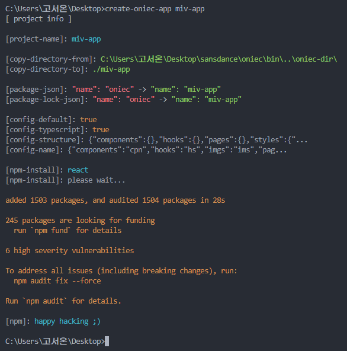

# 💫 react oniec &nbsp;-&nbsp;   

After ***React*** was installed, it was created so that developers would not do anything annoying and unpleasant, such as adding ***typescript*** files, creating folders, declaring types for images, and creating ***stylesheet*** files.

### 💬 Differences from traditional *React* installations

- All unnecessary files are installed deleted.
- Add default settings for ***typescript***
- Set up to use ***react-router-dom***
- Set up to use ***react custom hook***
- Set up for **Landing Page** and **Error Page**.
- In addition, it also removes the default settings for `margin` and `padding` in the browser.

### 💬 Precautions for Use

The ***create-oniec-app*** library uses the `exec` function of the library called ***child_process***. When a function is used, problems such as deleting or modifying existing files can occur.

### 📌 How to install

Read [***precautions***](#💬-precautions-for-use) before installing!

Run from the shell of the operating system:

```
$ npm install -g create-oniec-app
$ npx create-oniec-app <your-project-name>
```



### 🎬 How to run

Run from the shell of the operating system:

```
$ cd <your-project-location>
$ npm run dev
```

### 📂 Directory structure

⛔ ***Warning***: The structure below may differ from the one installed.

```
─ node_modules
─ public
─ src
    └> components
    └> fonts
    └> hooks
    └> imgs
    └> pages
        └> Home.tsx
        └> Error.tsx
        
    └> styles
        └> global.css

    └> App.tsx
    └> index.js
    └> reportWebVitals.js
    └> setupTests.js

- .gitignore
- index.d.ts
- package-lock.json
- package.json
- README.md
- tsconfig.json
```

### Release

[x] [npm ver 1.0.0](#)